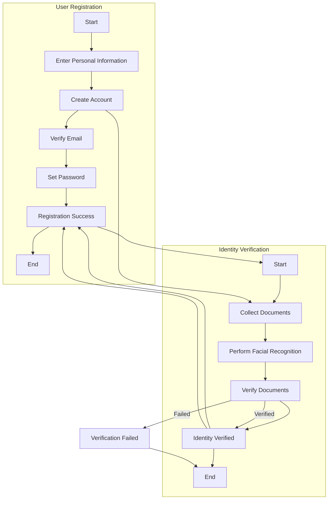
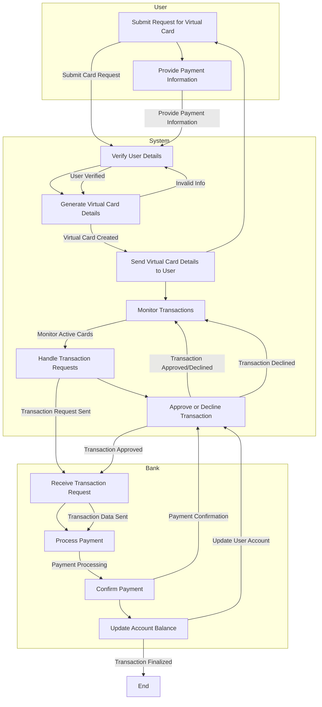
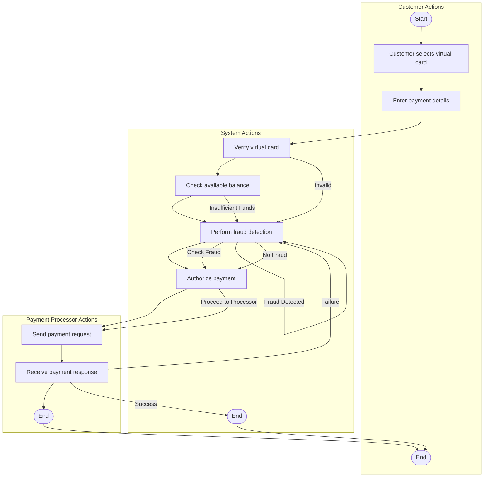
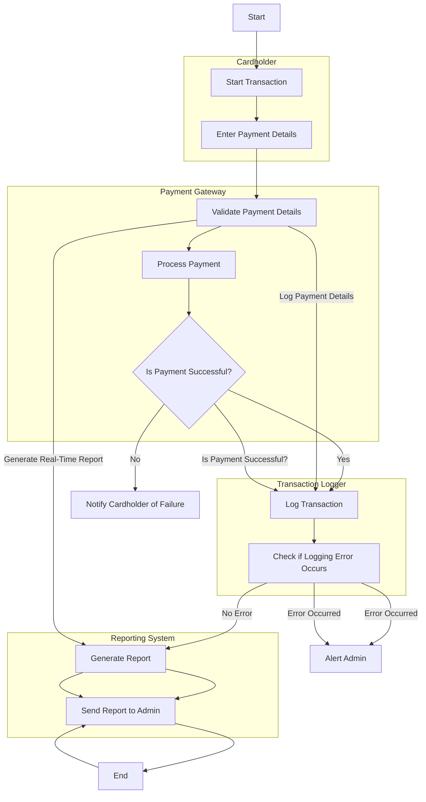
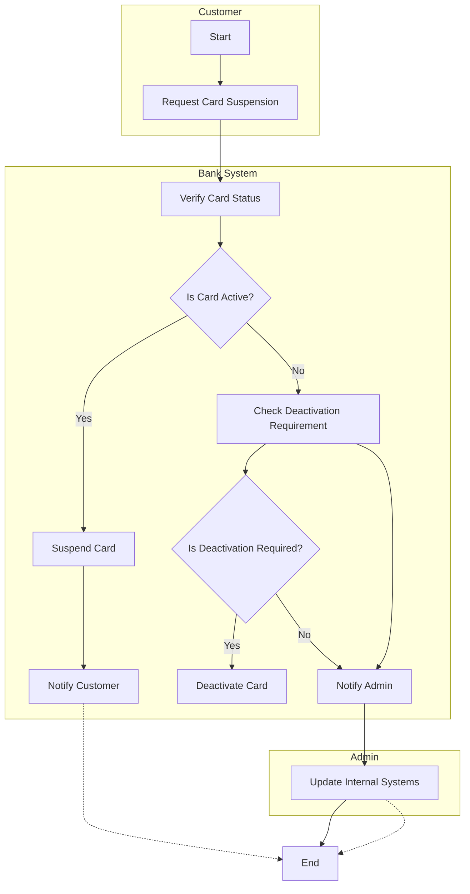
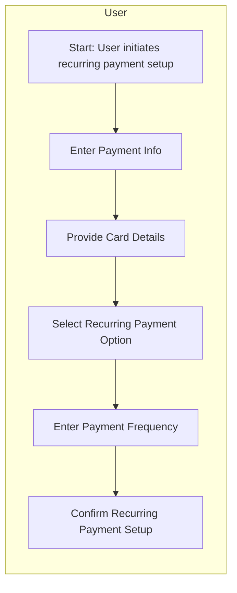
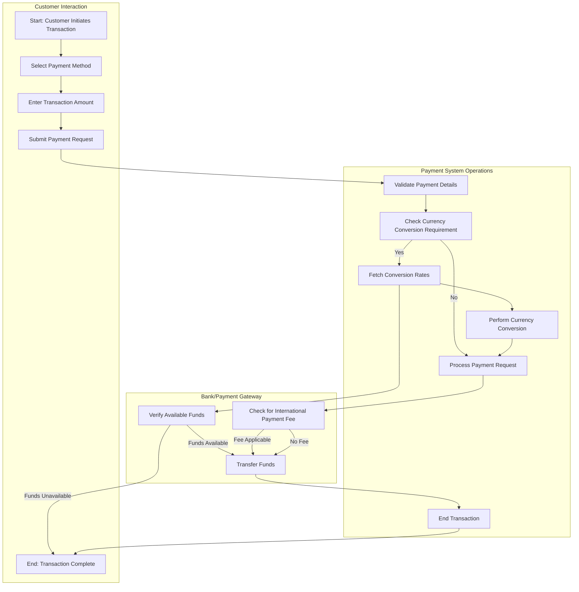
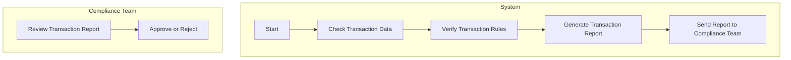

# Activity Diagrams

 
## 1. User Registration and Identity Verification

 

## 2. Virtual Card Generation and Management

 

## 3. Payment Authorization and Fraud Detection

 

## 4. Transaction Logging and Reporting

 

## 5. Card Suspension and Deactivation

 

## 6. Recurring Payment Setup and Management

 

## 7. Currency Conversion and International Transactions

 

## 8. Compliance and Regulatory Reporting

