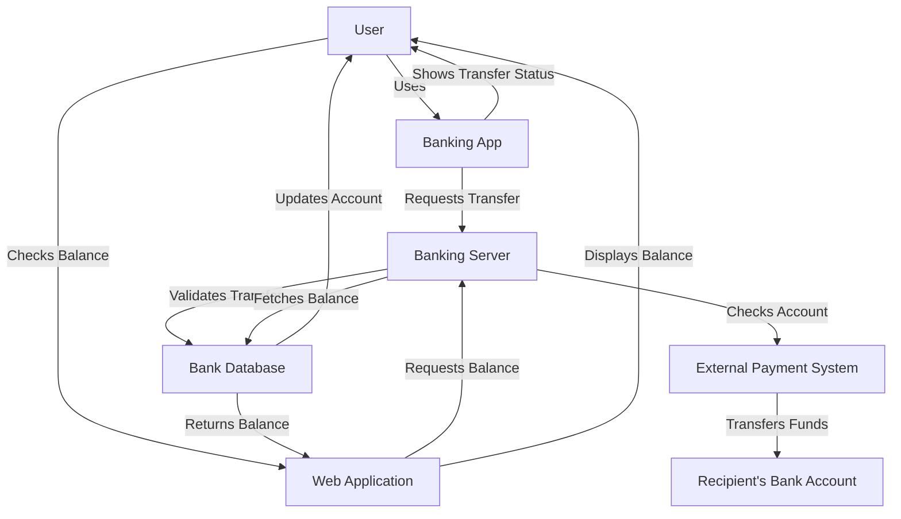
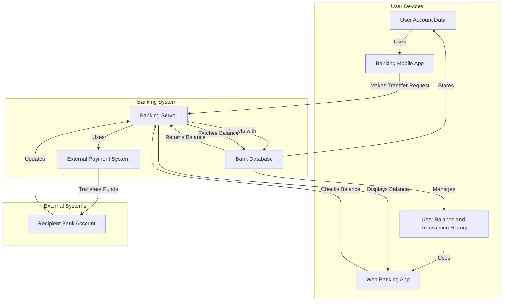
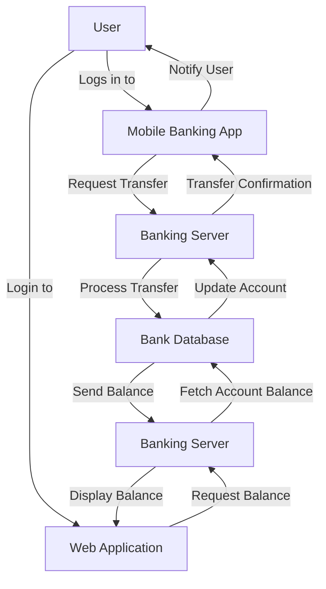
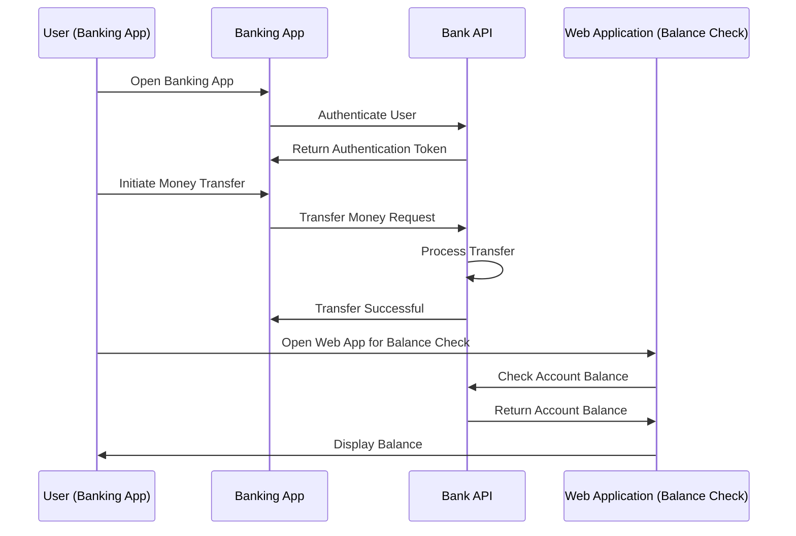

# Mermaid Diagrams

## Context Diagram

```mermaid
graph TD
  A[User] -->|Uses| B[Banking App]
  B -->|Requests Transfer| C[Banking Server]
  C -->|Validates Transfer| D[Bank Database]
  C -->|Checks Account| E[External Payment System]
  E -->|Transfers Funds| F[Recipient's Bank Account]
  D -->|Updates Account| A
  B -->|Shows Transfer Status| A

  A -->|Checks Balance| G[Web Application]
  G -->|Requests Balance| C[Banking Server]
  C -->|Fetches Balance| D[Bank Database]
  D -->|Returns Balance| G
  G -->|Displays Balance| A


```

## Container Diagram

```mermaid
graph TD
  subgraph UserDevices [User Devices]
    direction TB
    A1[Mobile Device] -->|Uses| B1[Banking Mobile App]
    A2[Desktop/Laptop] -->|Uses| B2[Web Banking App]
  end

  subgraph BankingSystem [Banking System]
    direction LR
    B1 -->|Makes Transfer Request| S1[Banking Server]
    B2 -->|Checks Balance| S1[Banking Server]
    S1 -->|Interacts with| DB1[Bank Database]
    S1 -->|Uses| ES1[External Payment System]
  end

  subgraph ExternalSystem [External Systems]
    direction LR
    ES1 -->|Transfers Funds| R1[Recipient Bank Account]
  end

  %% Relationships
  DB1 -->|Stores| A1[User Account Data]
  DB1 -->|Manages| A2[User Balance and Transaction History]
  R1 -->|Updates| S1[Banking Server]
  S1 -->|Fetches Balance| DB1
  DB1 -->|Returns Balance| S1
  S1 -->|Displays Balance| B2


```

## Component Diagram

```mermaid
  graph TD
    A[User] -->|Logs in to| B[Mobile Banking App]
    B -->|Request Transfer| C[Banking Server]
    C -->|Process Transfer| D[Bank Database]
    D -->|Update Account| C
    C -->|Transfer Confirmation| B
    B -->|Notify User| A
    A -->|Login to| E[Web Application]
    E -->|Request Balance| F[Banking Server]
    F -->|Fetch Account Balance| D
    D -->|Send Balance| F
    F -->|Display Balance| E

```

## Code Diagram

```mermaid
sequenceDiagram
    participant User as User (Banking App)
    participant App as Banking App
    participant API as Bank API
    participant WebApp as Web Application (Balance Check)

    User->>App: Open Banking App
    App->>API: Authenticate User
    API->>App: Return Authentication Token
    User->>App: Initiate Money Transfer
    App->>API: Transfer Money Request
    API->>API: Process Transfer
    API->>App: Transfer Successful
    User->>WebApp: Open Web App for Balance Check
    WebApp->>API: Check Account Balance
    API->>WebApp: Return Account Balance
    WebApp->>User: Display Balance

```
