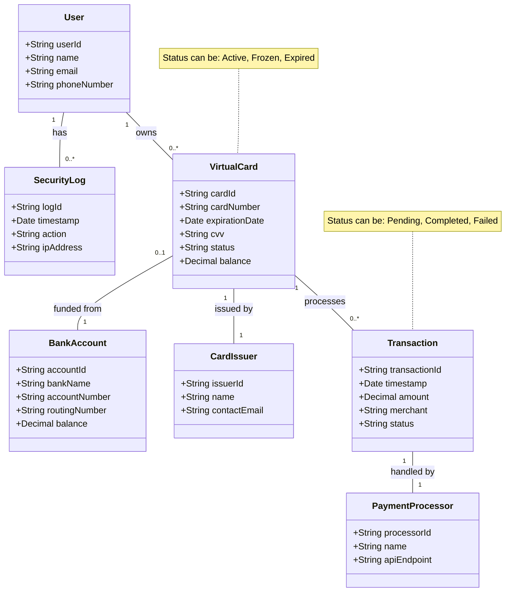

```mermaid
classDiagram

%% Classes
class User {
  +String userId
  +String name
  +String email
  +String phoneNumber
}

class VirtualCard {
  +String cardId
  +String cardNumber
  +Date expirationDate
  +String cvv
  +String status
  +Decimal balance
}

class Transaction {
  +String transactionId
  +Date timestamp
  +Decimal amount
  +String merchant
  +String status
}

class PaymentProcessor {
  +String processorId
  +String name
  +String apiEndpoint
}

class BankAccount {
  +String accountId
  +String bankName
  +String accountNumber
  +String routingNumber
  +Decimal balance
}

class CardIssuer {
  +String issuerId
  +String name
  +String contactEmail
}

class SecurityLog {
  +String logId
  +Date timestamp
  +String action
  +String ipAddress
}

%% Relationships
User "1" -- "0..*" VirtualCard : owns
VirtualCard "1" -- "0..*" Transaction : processes
VirtualCard "1" -- "1" CardIssuer : issued by
VirtualCard "0..1" -- "1" BankAccount : funded from
Transaction "1" -- "1" PaymentProcessor : handled by
User "1" -- "0..*" SecurityLog : has

%% Notes
note for VirtualCard "Status can be: Active, Frozen, Expired"
note for Transaction "Status can be: Pending, Completed, Failed"

```