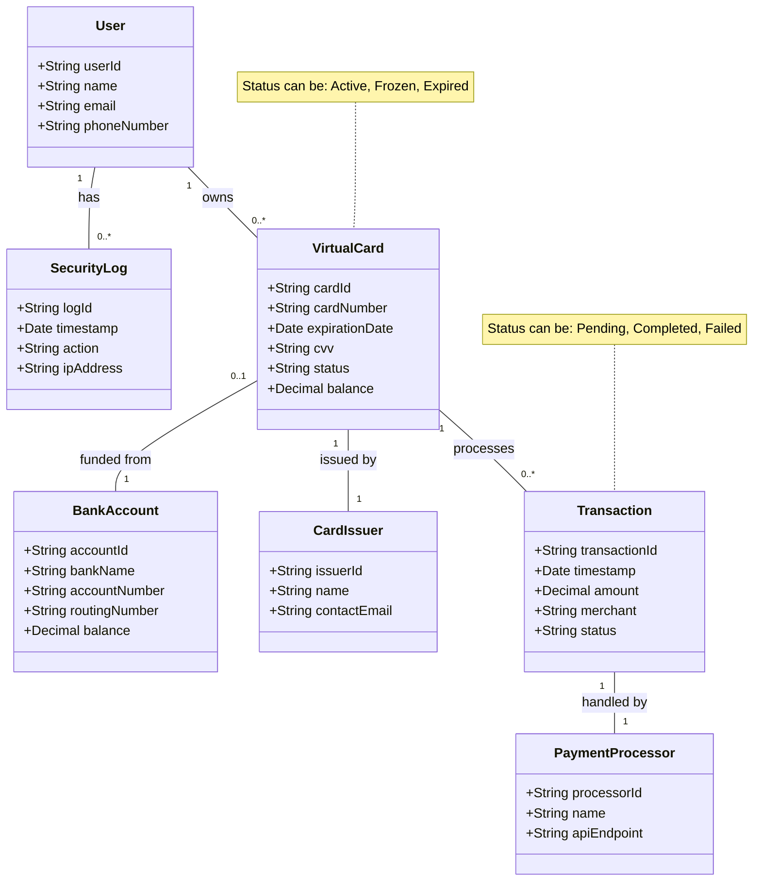

### **Class Diagram**

#### **Class Diagram Description**

##### **1\. User**

Represents a system user.

- +String userId: Unique identifier for the user.
- +String name: User’s full name.
- +String email: User’s email address.
- +String phoneNumber: User’s contact number.

**2\. VirtualCard**

Represents a digital card associated with a user.

- +String cardId: Unique identifier for the virtual card.
- +String cardNumber: The card number (usually 16 digits).
- +Date expirationDate: Expiry date of the card.
- +String cvv: Security code of the card.
- +String status: Current status of the card (see note below).
- +Decimal balance: Current balance available on the card.

**3\. Transaction**

Represents a financial transaction made using a virtual card.

- +String transactionId: Unique transaction identifier.
- +Date timestamp: Date and time of the transaction.
- +Decimal amount: Amount of money transacted.
- +String merchant: Merchant or vendor name.
- +String status: Status of the transaction.

**4\. PaymentProcessor**

Represents the payment gateway or processor handling transactions.

- +String processorId: Unique processor identifier.
- +String name: Processor name (e.g., Stripe, PayPal).
- +String apiEndpoint: URL or endpoint used to interact with the API.

**5\. BankAccount**

Represents a user’s linked bank account that can fund a virtual card.

- +String accountId: Unique bank account identifier.
- +String bankName: Name of the bank.
- +String accountNumber: Account number at the bank.
- +String routingNumber: Bank’s routing number.
- +Decimal balance: Available balance in the bank account.

**6\. CardIssuer**

Represents the institution that issues virtual cards.

- +String issuerId: Unique identifier for the issuer.
- +String name: Name of the issuing institution.
- +String contactEmail: Email to contact the issuer.

**7\. SecurityLog**

Represents logs related to security actions by the user.

- +String logId: Unique identifier for the log entry.
- +Date timestamp: When the security event happened.
- +String action: The security-related action performed (e.g., login, password change).
- +String ipAddress: IP address from which the action was performed.

**Relationships Between Classes**

1. User "1" -- "0..\*" VirtualCard : owns  
    \- A user can own zero or many virtual cards.
2. VirtualCard "1" -- "0..\*" Transaction : processes  
    \- A virtual card can process multiple transactions.
3. VirtualCard "1" -- "1" CardIssuer : issued by  
    \- Each virtual card is issued by exactly one card issuer.
4. VirtualCard "0..1" -- "1" BankAccount : funded from  
    \- A virtual card may (optionally) be linked to one bank account for funding.
5. Transaction "1" -- "1" PaymentProcessor : handled by  
    \- Every transaction is handled by exactly one payment processor.
6. User "1" -- "0..\*" SecurityLog : has  
    \- A user may have multiple security logs.
