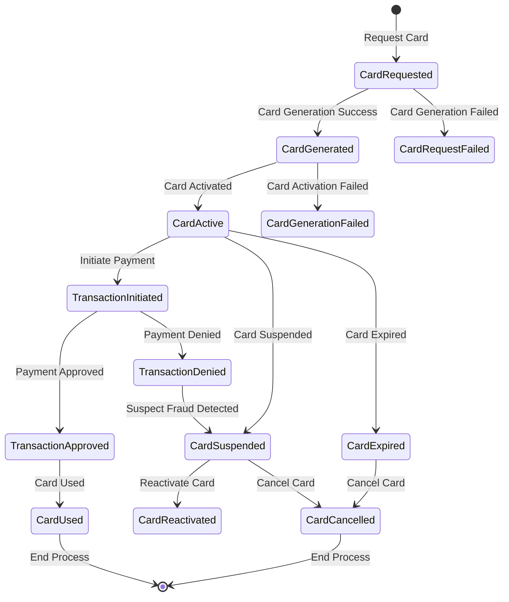
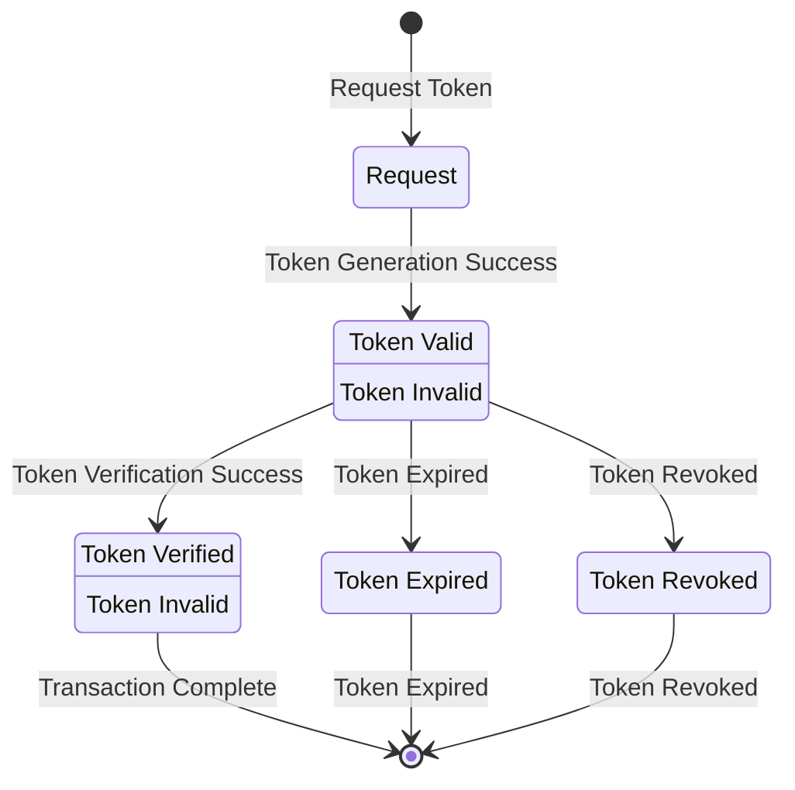
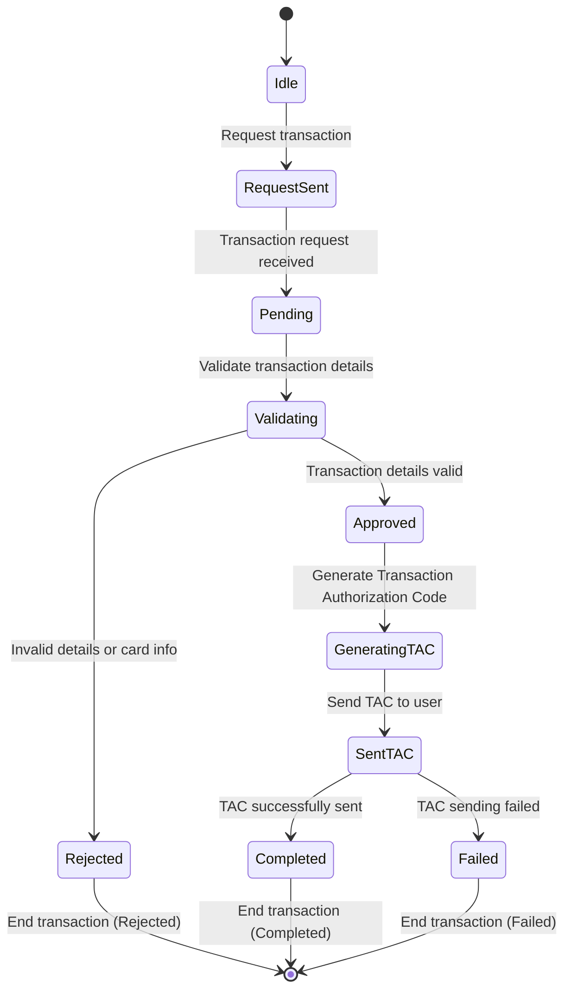
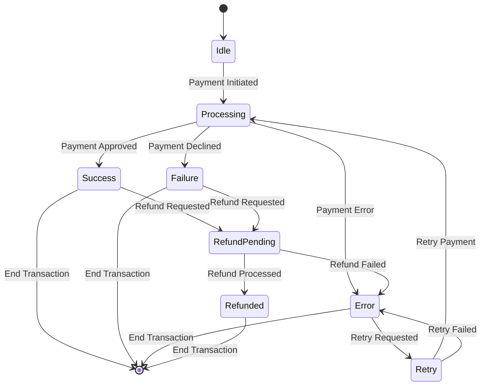
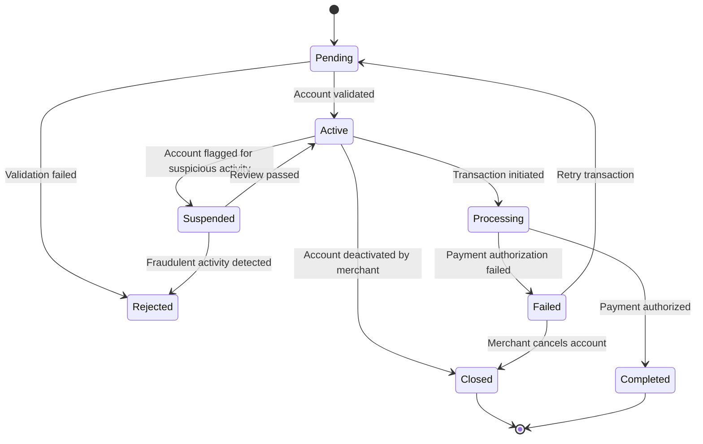
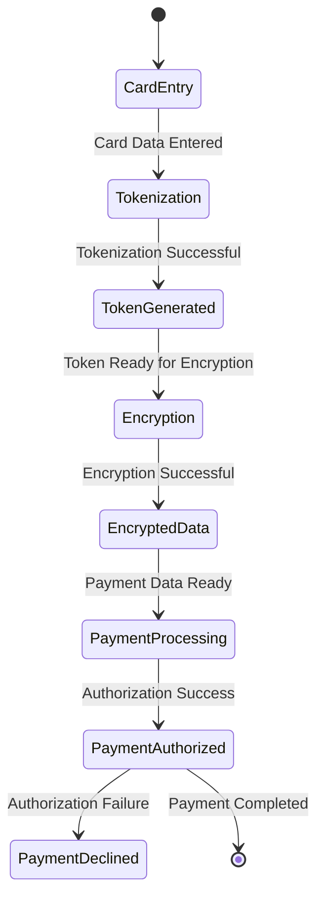
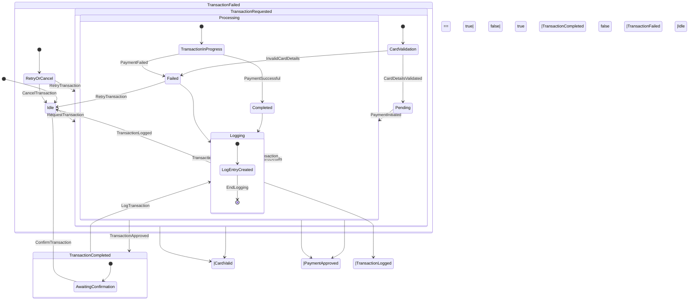
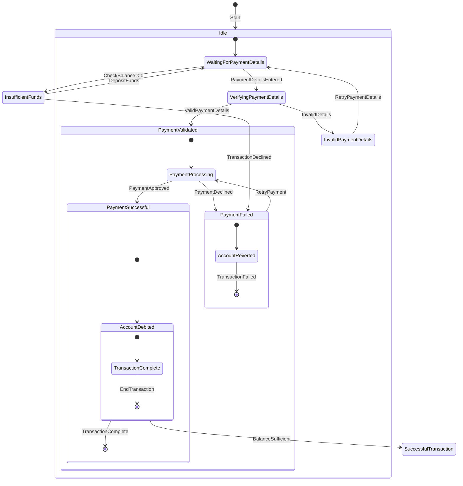

# State Transition Diagrams
 

### 1. Virtal Card Number
__________________________________________________________________________________________________________________________

 

### 2. Authentication Token
_____________________________________________________________________________________________________________________________________

 

## 3. Transaction Authorization Code

 

## 4. Payment Gateway

 

## 5. Merchant Account

## 6. Security Protocols

 

## 7. Transaction History/Logs
 

 

## 8. Virtual Account

